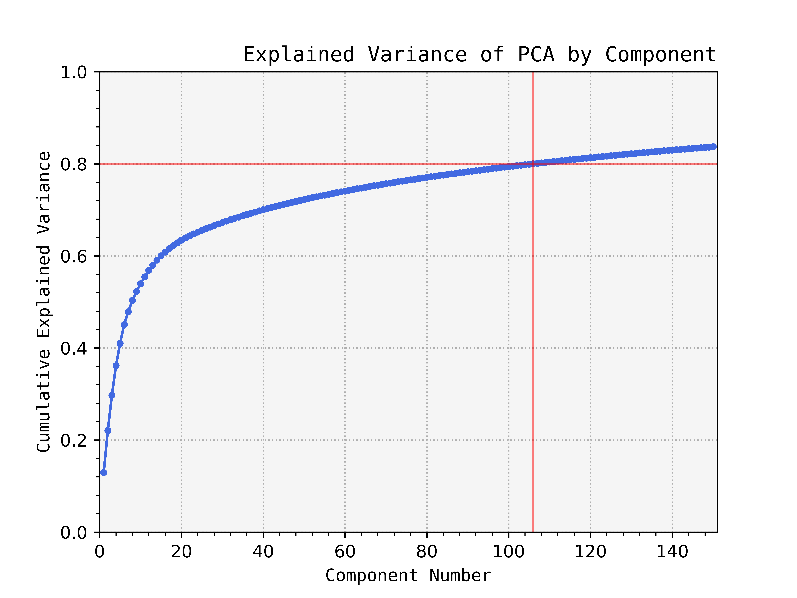
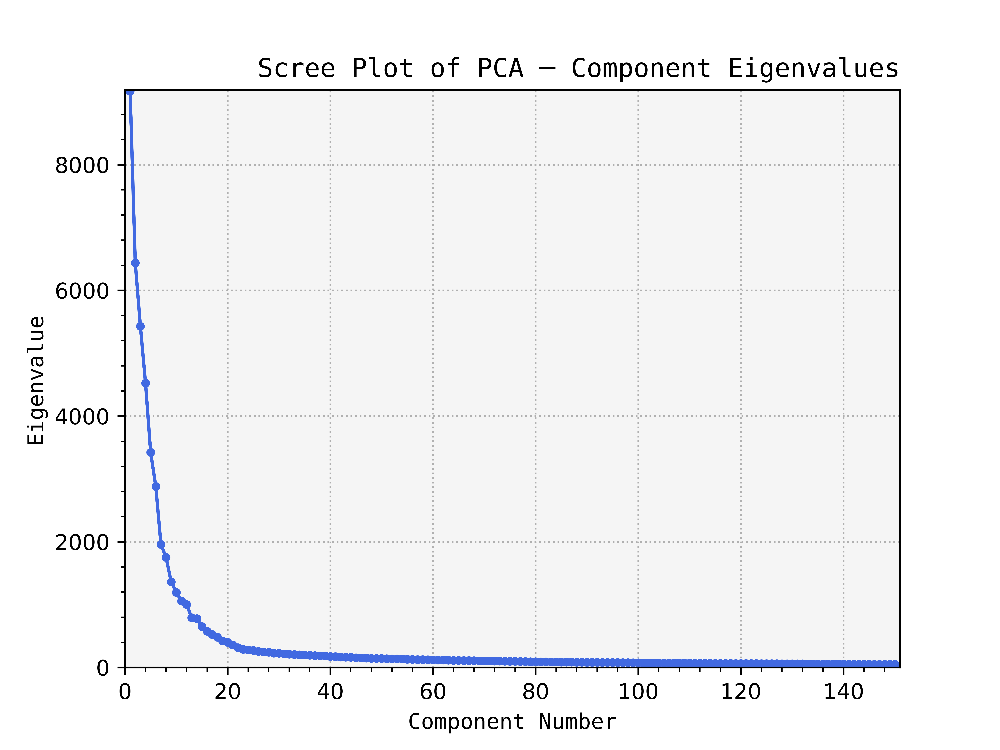

`/Offspring_Principal_Component_Analysis`: This directory contains 4 files:

- `Cummulative_Explained_Variance.png`:
  - Explained variance of Principal Component Analysis by component.
  - Variance Threshold = 0.8 (80%)
  - The interpolated principal components needed to preserve the variance threshold are 106.

  

- `Principal_Components.png`:
  - Composite plot of the first 40 principal components from the Offspring Genotype Data.

  

- `Principal_Components_Highlighted_Subsample.png`:
  - Composite plot of the first 40 principal components from the Offspring genotype Data.
  - A subsample of individuals with the same male parent is highlighted to observe clustering capabilities.

  

- `Scree.png`:
  - Eigenvalues per component of the Offspring Genotype Data Principal Component Analysis.

  
